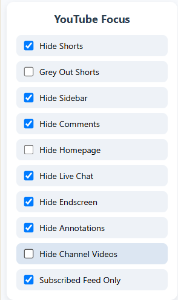

# YouTube Focus Mode 🔍🎯

A Chrome extension that helps you stay focused while using YouTube by hiding distracting elements like Shorts, Sidebar, Comments, Endscreen videos, and more — with toggleable options for a cleaner experience.

---

## 🌟 Features

- ✅ Hide YouTube Shorts (or just grey them out)
- ✅ Hide Sidebar panel
- ✅ Hide Comments section
- ✅ Hide Endscreen video suggestions
- ✅ Hide Annotations
- ✅ Hide Live Chat
- ✅ Hide all videos on any Channel's Videos tab
- ✅ Hide Homepage feed
- ✅ Auto-redirect to Subscriptions tab instead of the homepage
- ✅ Simple UI toggle in the extension popup

---

## 🧩 How to Install (for development)

1. Clone this repository or [Download ZIP](https://github.com/MrAvishek/YoutubeFocus/archive/refs/heads/main.zip)
2. Open Chrome and go to `chrome://extensions`
3. Enable **Developer mode** (toggle in top right)
4. Click **"Load unpacked"**
5. Select the folder where this extension is located

---

## 📂 Images

---

## ⚙️ Technologies Used

- JavaScript (Vanilla)
- Chrome Extensions APIs
- DOM Manipulation
- Local/Sync Storage

---

## 🧠 Why I Built This

YouTube is powerful, but sometimes it becomes too distracting. This extension was created to bring minimalism and intentionality back to your watch sessions.

---

## 📃 License

This project is licensed under the MIT License.

---

## 💡 Contribution

Found a bug or want a new feature?  
Feel free to open an issue or submit a pull request!

---

Made with ❤️ by [Avishek Mondal](https://github.com/MrAvishek)
